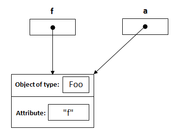

# DSA
 Just-Pushing-whatever-learn-to-git

# Java insight

Java always passes arguments by value NOT by reference.

Let me explain this through an example:

```java
public class Main
{
     public static void main(String[] args)
     {
          Foo f = new Foo("f");
          changeReference(f); // It won't change the reference!
          modifyReference(f); // It will modify the object that the reference variable "f" refers to!
     }
     public static void changeReference(Foo a)
     {
          Foo b = new Foo("b");
          a = b;
     }
     public static void modifyReference(Foo c)
     {
          c.setAttribute("c");
     }
}
```

I will explain this in steps:

Declaring a reference named f of type Foo and assign it to a new object of type Foo with an attribute "f".

Foo f = new Foo("f");


From the method side, a reference of type Foo with a name a is declared and it's initially assigned to null.

public static void changeReference(Foo a)


As you call the method changeReference, the reference a will be assigned to the object which is passed as an argument.

changeReference(f);


Declaring a reference named b of type Foo and assign it to a new object of type Foo with an attribute "b".

Foo b = new Foo("b");


a = b is re-assigning the reference a NOT f to the object whose its attribute is "b".


As you call modifyReference(Foo c) method, a reference c is created and assigned to the object with attribute "f".


c.setAttribute("c"); will change the attribute of the object that reference c points to it, and it's same object that reference f points to it.

